# meal_recommender

## Getting Started

## App Description:
A personalized nutrition app built using Flutter and Firebase that offers daily meal plans based on individual dietary needs such as age, weight, gender, and health goals (e.g., weight loss or gain). It includes a smart recommendation system using a decision tree algorithm to suggest meals aligned with users’ macronutrient targets, a grocery manager that tracks pantry items, and local notifications for reminders. 

| Splash Screen | Home Screen | Login Screen | Register Screen
|-------------|-----------------|-------------|-----------------|
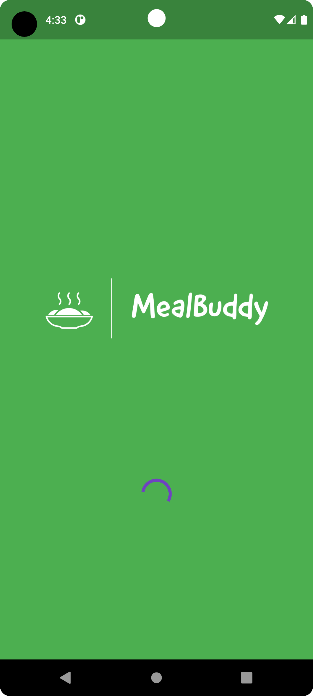 | 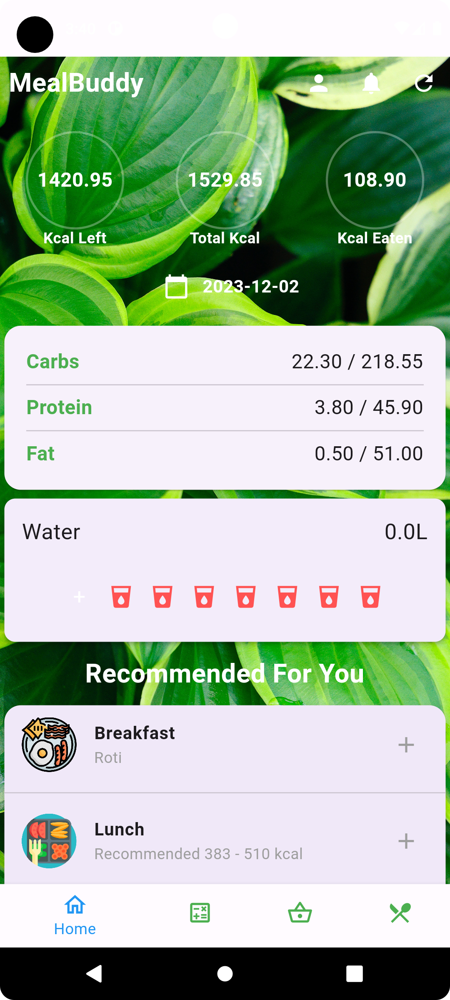 | 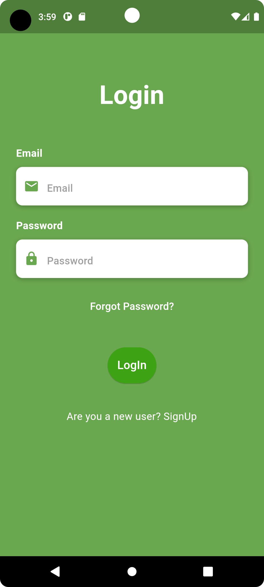 | 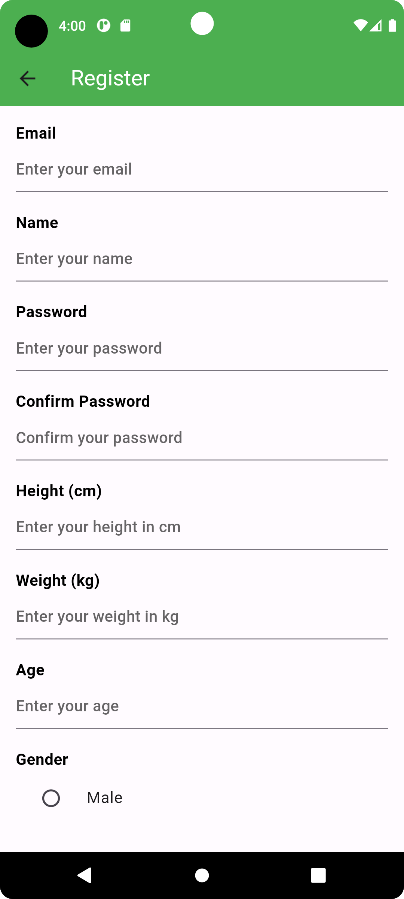

| BMI tool | DRI tool | Grocery | Update Grocery
|-------------|-----------------|-------------|-----------------|
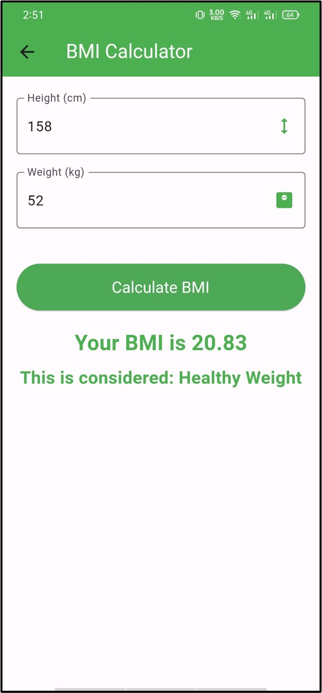 | 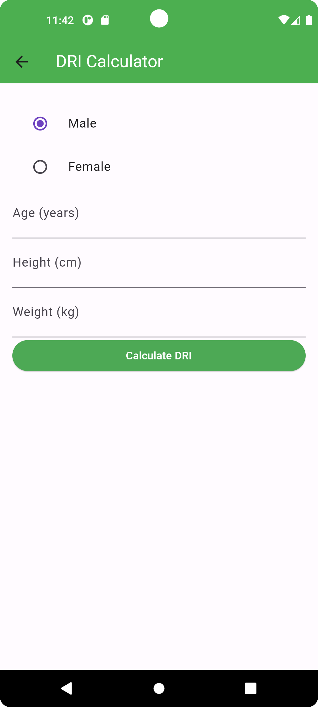 | 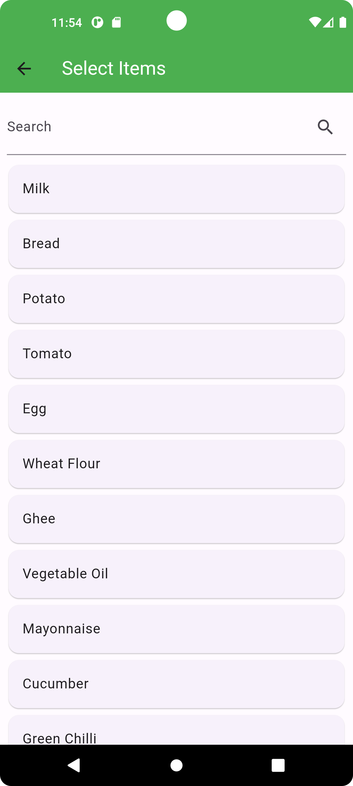 | 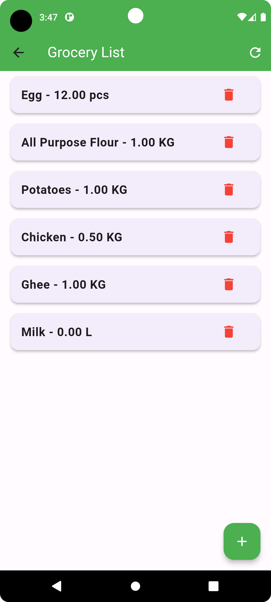

| Daily Meal | Meal Plan | Meal Select | Update calorie suggestion 
|-------------|-----------------|-------------|-----------------|
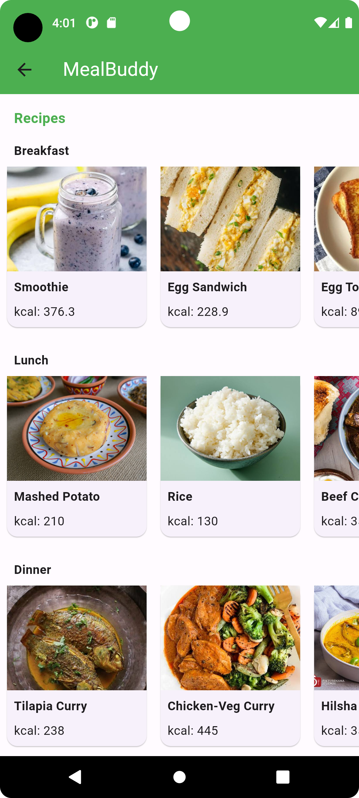 | 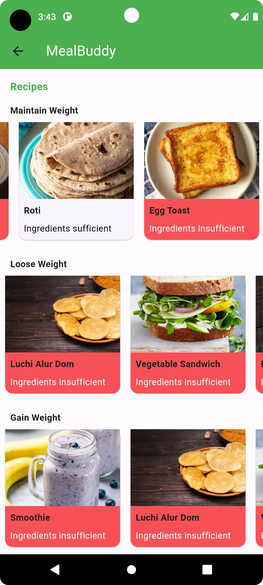 | 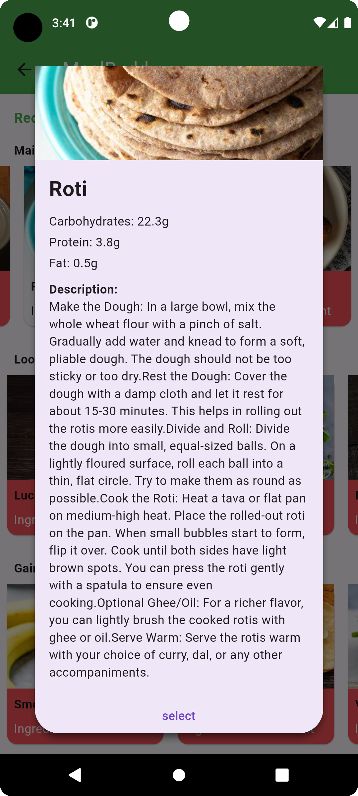 |  

| Daily Reminder | Profile | Profile Settings
|----------------|----------------|----------------|
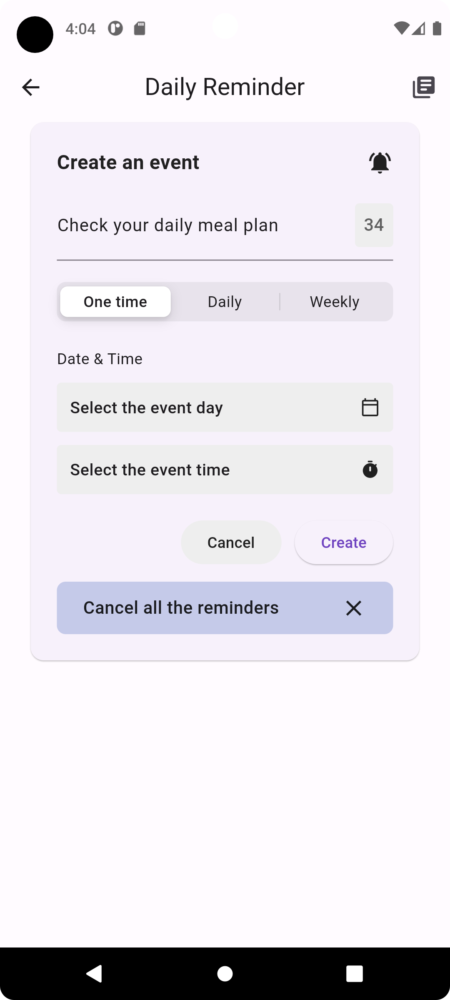 | 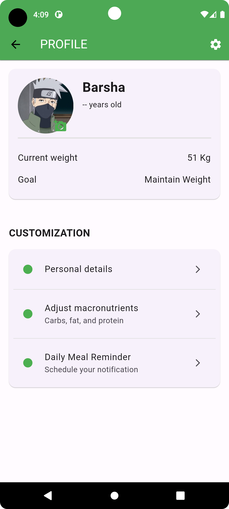 | 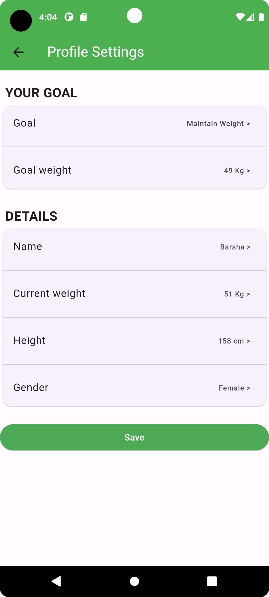 

## Algorithms Used :
- Greedy Algorithm
- Sorting Algorithm

## Tools, Language & Technologies:
- Flutter
- Firebase Database
- Dart
- Android Studio

A few resources to get you started if this is your first Flutter project:

- [Lab: Write your first Flutter app](https://docs.flutter.dev/get-started/codelab)
- [Cookbook: Useful Flutter samples](https://docs.flutter.dev/cookbook)

For help getting started with Flutter development, view the
[online documentation](https://docs.flutter.dev/), which offers tutorials,
samples, guidance on mobile development, and a full API reference.

